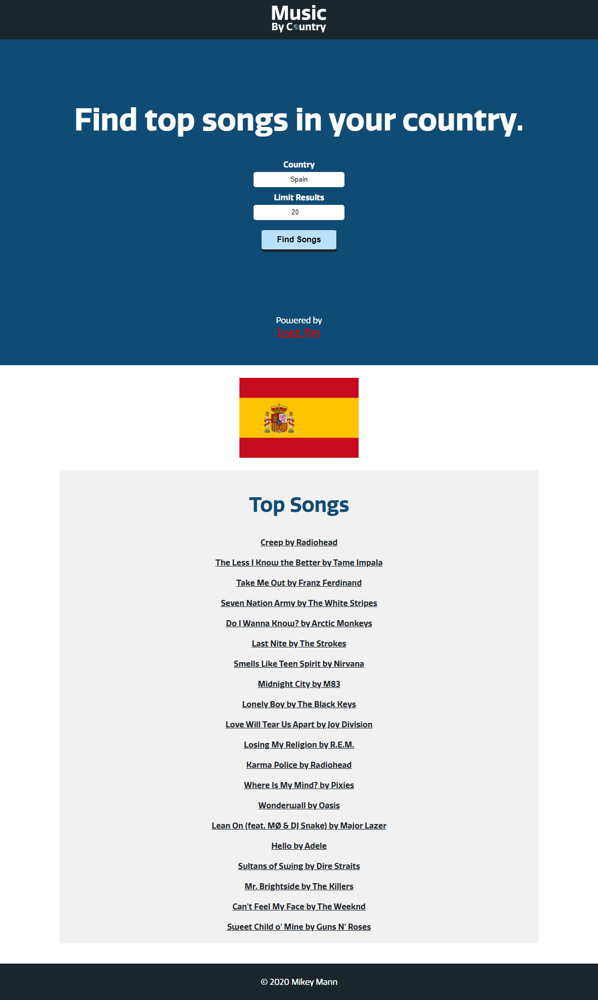

# Music by Country
Music by country utilizes both the LastFM and Restcountries APIs to help users understand the most popular songs on the LastFM platform while also returning the searched country's flag. It's simple, the user will be presented a form to query their desired country with a chosen limit set on how many are results are returned. Once the user submits the form, a list of top songs in that country is rendered to the DOM.

## Screenshot

## Demo
[Live Site](https://imikeyi03.github.io/Music-By-Country "Music By Country")

### Built with
* HTML5
* CSS3
* Javascript
* JQuery
